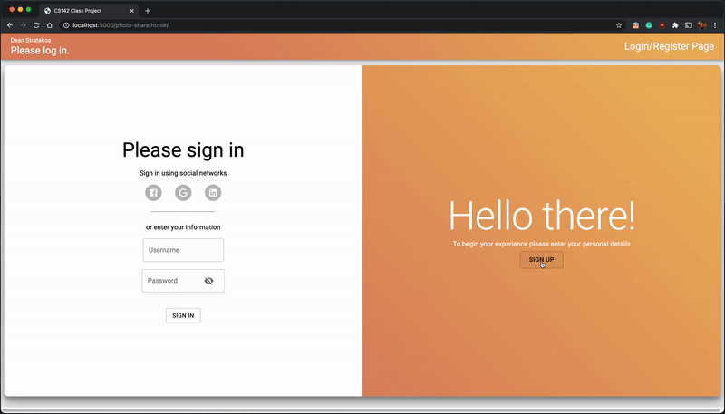
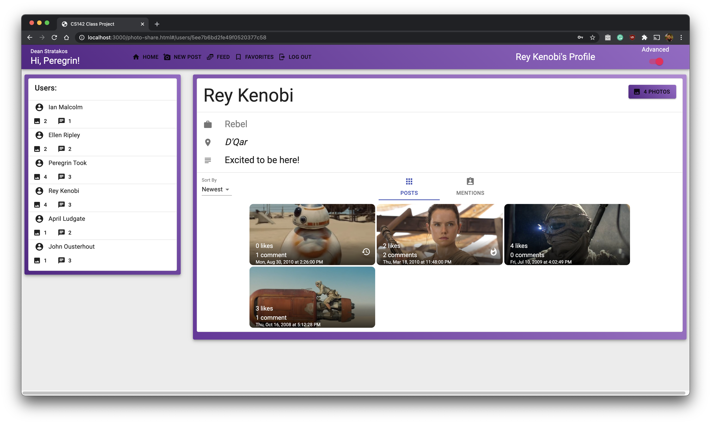
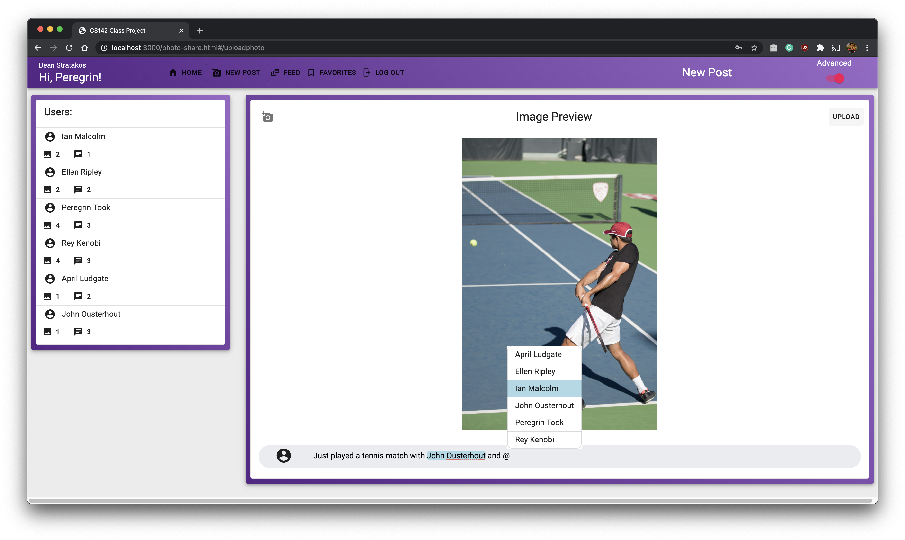
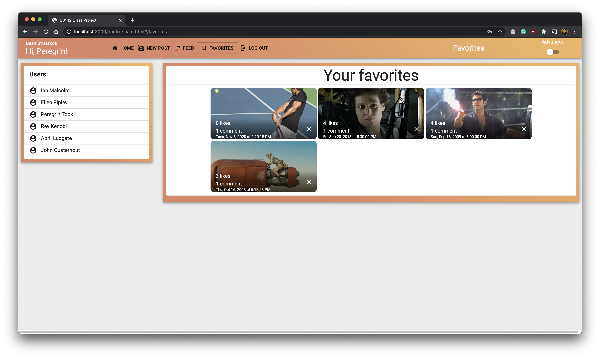
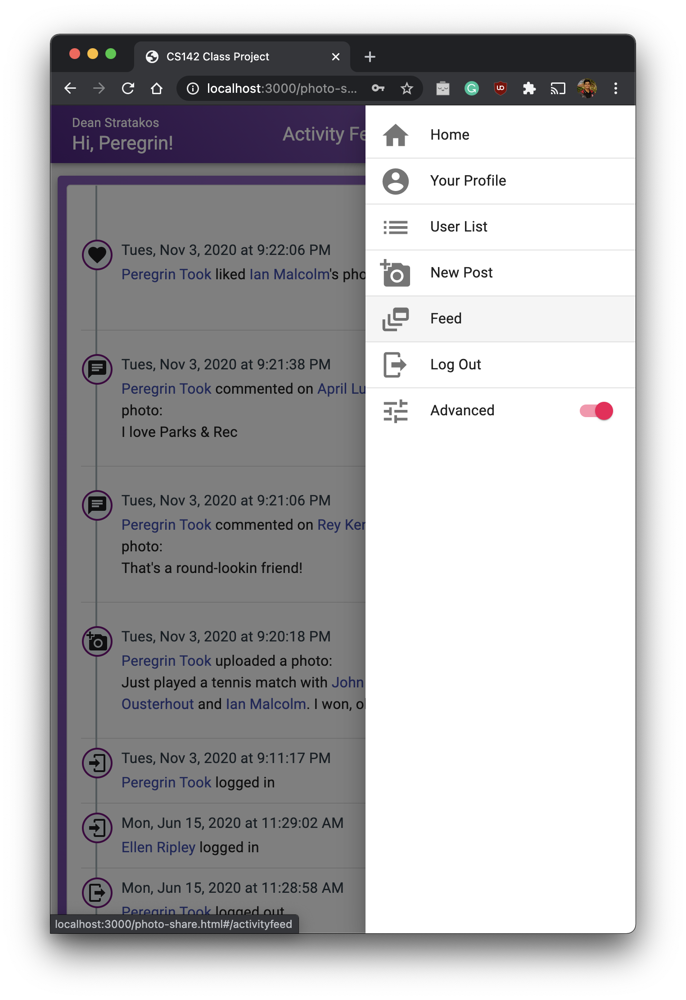

<!-- PROJECT SHIELDS -->
[![Contributors][contributors-shield]][contributors-url]
[![Forks][forks-shield]][forks-url]
[![Stargazers][stars-shield]][stars-url]
[![Issues][issues-shield]][issues-url]
[![MIT License][license-shield]][license-url]
[![LinkedIn][linkedin-shield]][linkedin-url]

<div align="center">
    <h2 style="font-size: 50px; font-weight: bold; margin: 0px;">
        Photo Sharing Web Application
    </h2>
    <h2 style="font-size: 30px; margin: 0px;">
        Dean Stratakos
    </h2>
    <h3>June 10, 2020</h3>
    A photo sharing web application for my Stanford 
    <a href=https://web.stanford.edu/class/cs142/projects.html>CS 142</a>
    final project.
    <br />
    <a href="https://github.com/dastratakos/Photo-Sharing-Web-Application">
        Explore the docs
    </a>
    ·
    <a href="https://github.com/dastratakos/Photo-Sharing-Web-Application/issues">
        Request Feature
    </a>
</div>

<!-- TABLE OF CONTENTS -->
## Table of Contents

* [About the Project](#about-the-project)
* [Demo](#demo)
* [Getting Started](#getting-started)
  * [Prerequisites](#prerequisites)
  * [Installation](#installation)
* [Usage](#usage)
* [Roadmap](#roadmap)
* [License](#license)
* [Contact](#contact)

<!-- ABOUT THE PROJECT -->
## About the Project

In May and June of 2020, I created a photo sharing web application over the
course of four project submissions for
[CS 142: Web Applications](https://web.stanford.edu/class/cs142/projects.html),
a course taught at Stanford University. The application has similar
functionality to that of Facebook, Instagram, and other popular social media
platforms. At a high level, this application is a site where users can post
photos, comment on and like others' posts, save a favorites list of posts, see
community activity, and more.

This application uses the MERN stack - MongoDB, Express.js, React, and Node.js.
All of the processes are run locally on one machine, meaning that the website
is not hosted online. However, I might explore making those upgrades later down
the road.

Note that, due to the
[Stanford Honor Code](https://communitystandards.stanford.edu/policies-and-guidance/honor-code),
I have not made my code publicly available.

## Demo

Here are a video and screenshots of the app in action. The user can choose to
be in normal mode (orange) or advanced mode (purple).

<div align="center">
    <p>Login animation</p>
    
    <br></br>
    <p>User Profile and Advanced Mode</p>
    
    <br></br>
    <p>New Post and @mentions</p>
    
    <br></br>
    <p>Favorites</p>
    
    <br></br>
    <p>Responsive design and Activity Feed (advanced mode)</p>
    
</div>

For a more in-depth look, watch this
[YouTube video](https://www.youtube.com/watch?v=mFzJm07WL5A) in which I
demonstrate a handful of the latest features that I added.

<!-- GETTING STARTED -->
## Getting Started

To get a local copy up and running follow these simple steps.

<hr align="left" width="50%" style="margin-left: 15px">

### Prerequisites

* [Node.js]()
* [MongoDB]()

<hr align="left" width="50%" style="margin-left: 15px">

### Installation

1. Clone the repo.
```sh
git clone https://github.com/dastratakos/Photo-Sharing-Web-Application.git
```
2. Install the required `npm` packages.
```sh
npm install
```
3. Run each of the three following commands in separate terminal windows, and
   keep the processes running.
```sh
mongod --dbpath /usr/local/var/mongodb
```
```sh
./node_modules/.bin/nodemon webServer.js
```
```sh
npm run build:w
```
4. Open
   [`http://localhost:3000/photo-share.html`](http://localhost:3000/photo-share.html)
   in a web browser (preferably Google Chrome).

<!-- ROADMAP -->
## Roadmap

### Project 8
#### Wed, June 10, 2020
* [x] Users can mention other users in comments with the `@` symbol.
* [x] User profile includes a photo grid with information such as number of
      likes and the time posted.
* [x] There is an Activity feed to show the 20 latest activities on the site.
* [x] Responsive design for different devices and screen sizes.
* [x] Users can like and unlike posts.
* [x] Users can edit and delete comments that they authored.
* [x] Users can favorite posts and view their saved posts in the Favorites tab.
      Clicking on a favorite post will display a larger modal.

### Project 7
#### Tues, June 2, 2020
* [x] Sessions and input allows for multiple users with unique logins. New
      users can register with a new profile.
* [x] The login page has a smooth animation between the log in and sign up
      sections.
* [x] Users can comment on photos.
* [x] Users can upload new photos.
* [x] Passwords are salted for additional security.
* [x] The app remembers who is logged in even after the browser is refreshed.

### Project 6
#### Thurs, May 21, 2020
* [x] The web server uses a MongoDB database instead.
* [x] The [axios](https://github.com/axios/axios) npm package is used to
      support RESTful API.
* [x] There is an advanced mode that can be toggled on and off. Advanced mode
      allows users to see how many posts and comments each user has made from
      the `UserList`.

### Project 5
#### Thurs, May 14, 2020
* [x] The single page application includes a `UserList`, `UserDetail`,
      `UserPhotos`, and `TopBar` components.
* [x] Styling is done using [Material-UI](https://material-ui.com/) components.
* [x] The model data consists of four types of objects: `user`, `photo`,
      `comment`, and `SchemaInfo`.
* [x] A web server allows model data to be fetched.
* [x] Users can view photos one at a time with a stepper view, which is useful
      for users with a large number of photos.

<!-- LICENSE -->
## License

Distributed under the Apache 2.0 License. See the [`LICENSE`](LICENSE) for more
information.

<!-- CONTACT -->
## Contact

Dean Stratakos - [dstratak@stanford.edu](mailto:dstratak@stanford.edu)

<!-- MARKDOWN LINKS & IMAGES -->
<!-- https://www.markdownguide.org/basic-syntax/#reference-style-links -->
[contributors-shield]: https://img.shields.io/github/contributors/dastratakos/Photo-Sharing-Web-Application.svg?style=flat-square
[contributors-url]: https://github.com/dastratakos/Photo-Sharing-Web-Application/graphs/contributors
[forks-shield]: https://img.shields.io/github/forks/dastratakos/Photo-Sharing-Web-Application.svg?style=flat-square
[forks-url]: https://github.com/dastratakos/Photo-Sharing-Web-Application/network/members
[stars-shield]: https://img.shields.io/github/stars/dastratakos/Photo-Sharing-Web-Application.svg?style=flat-square
[stars-url]: https://github.com/dastratakos/Photo-Sharing-Web-Application/stargazers
[issues-shield]: https://img.shields.io/github/issues/dastratakos/Photo-Sharing-Web-Application.svg?style=flat-square
[issues-url]: https://github.com/dastratakos/Photo-Sharing-Web-Application/issues
[license-shield]: https://img.shields.io/github/license/dastratakos/Photo-Sharing-Web-Application.svg?style=flat-square
[license-url]: https://github.com/dastratakos/Photo-Sharing-Web-Application/blob/main/LICENSE
[linkedin-shield]: https://img.shields.io/badge/-LinkedIn-black.svg?style=flat-square&logo=linkedin&colorB=555
[linkedin-url]: https://linkedin.com/in/dean-stratakos-8b338b149
